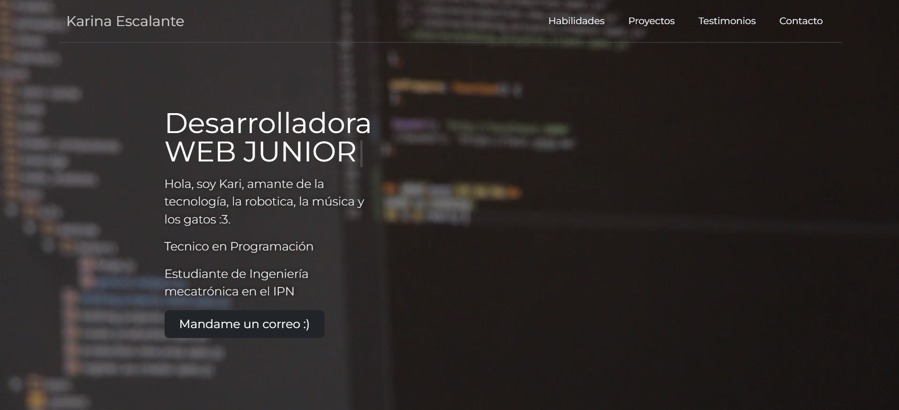
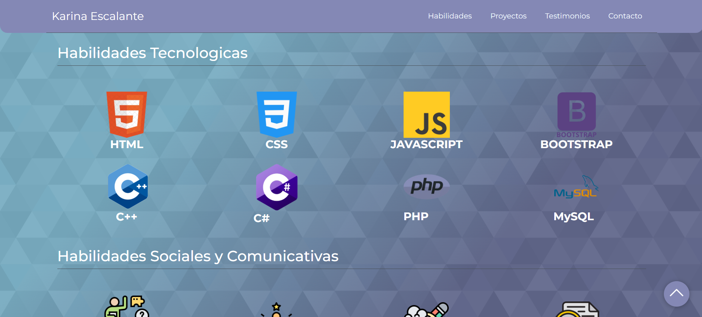
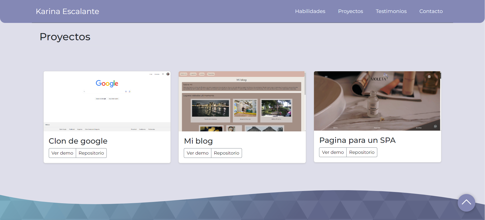
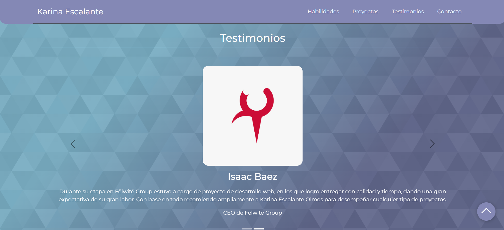
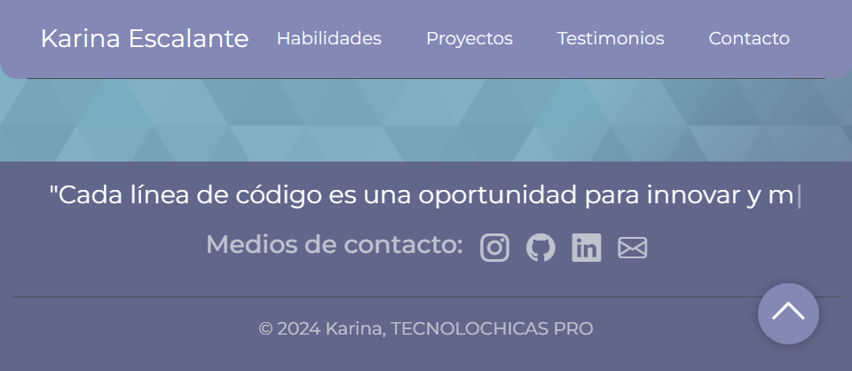

# Portafolio de habilidades TECHNOLOCHICAS PRO

El presente proyecto es un portafolio desarrollado para poner en practica las habilidades obtenidas dentro del bootcamp de desarrollo frontend de Technolochicas PRO

Fue desarrollado con HTML, CSS y JS con el uso del framework de UI, Bootstrap utilizando ademas bibliotecas externas.

La pagina es responsiva (adaptable a diferentes tamaños de pantalla) e incluye la presentación de la autora del proyecto

[Proyecto Desplegado (https://portafolio-karina.vercel.app/)](https://portafolio-karina.vercel.app/)

## Secciones de mi sitio

## Tecnologia
* HTML
* CSS
* Bootstrap
* Javascript

---
Desarrollado con 🤍 por [Karina Escalante](https://www.instagram.com/kary_olmos_22?igsh=aHI4c2hubzB3NXEx) en [TECHNOLOCHICAS PRO](https://tecnolochicas.mx/)
